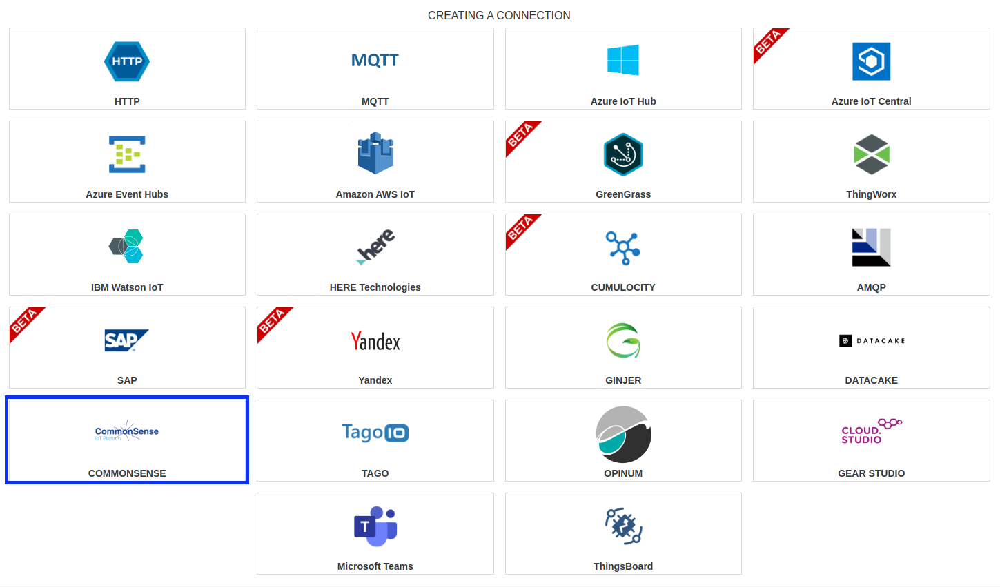
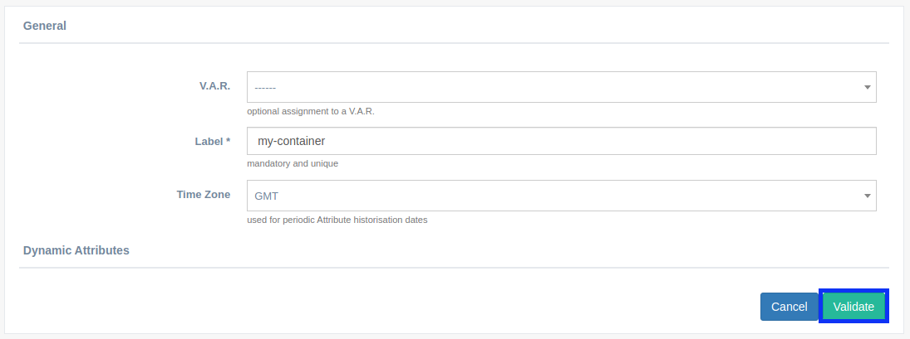
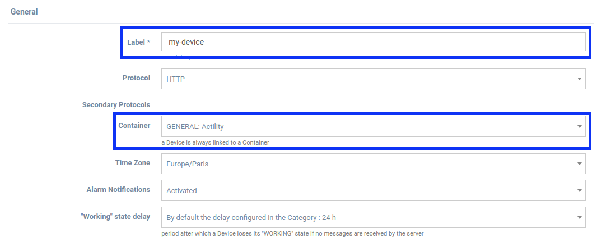

# CREATING A COMMONSENSE CONNECTION

## Creating a Connection With API

The creation of a connection establishes a unidirectional messaging transport link to the cloud provider.

To do this, you need to use the **Connections** group resource:
*	`POST/connections` to create a new Connection instance
*	`PUT/connections` to update a Connection instance
*	`DELETE/connections` to delete a Connection instance

::: tip Note
We follow the REST-full API pattern, when updating configuration properties for a connection resource. Thus, you must also provide the whole configuration again.
:::

Example for creation of a new connection instance :

```json
POST /connections
{
  "name":"Actility To CommonSense",
  "connectorId":"actility-http-iot",
  "configuration": {},
  "brand":"COMMONSENSE"
}
```

The following table lists the properties applicable to a connection instance.

| Field | Description |
| ------ | ----------- |
| ```connectorId``` | Must be set to actility-http-iot for CommonSense platform. |
| ```brand``` | Must be set to ```COMMONSENSE```. |

::: warning Important note
All properties are not present in this example. You can check the rest of these properties in the [common parameters section](../../Getting_Started/Setting_Up_A_Connection_instance/About_connections.html#common-parameters).
:::

## Creating a Connection With UI

1. Click Connections -> Create -> **ThingPark X IoT Flow**


2. Then, a new page will open. Select the connection type: **CommonSense**.


3. Fill in the form as in the example below and click on **Create**.


4. A notification appears on the upper right side of your screen to confirm that the application has been created.

5. After creating the application, you will be redirected to the connection details.

## Limitations

Limitations depends on Account Plan you own.

## Displaying information to know if it worked

1. Connect to your **CommonSense** instance.

2. Then, create a Container by clicking the **Add** button.


3. Choose a **Label** name, a Time Zone corresponding to your country, and click **Validate**


4. Now, go on **Products** section, in **Devices**, and select a Actility suitable device. Here we are using Elsys ERS device.


5. Choose the **Category** containing **Actility**


6. Fill in the form. **Label** will be the name of your device, **Container** we created before. **HTTP_ID** must be your **Device EUI**. You can click **Validate** button when you have done all the necessary.



7. You'll now be able to see if your connection worked by naviguating in **Provisioning**, **List** under **Devices** section.


8. Now check in the **Last Data** section to see if your messages arrived!


Otherwise, you will get this message (It may be possible that your device not send message yet).


## Troubleshooting

As for now, there are no detected bugs.