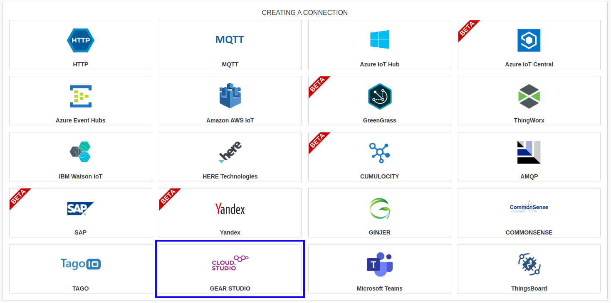
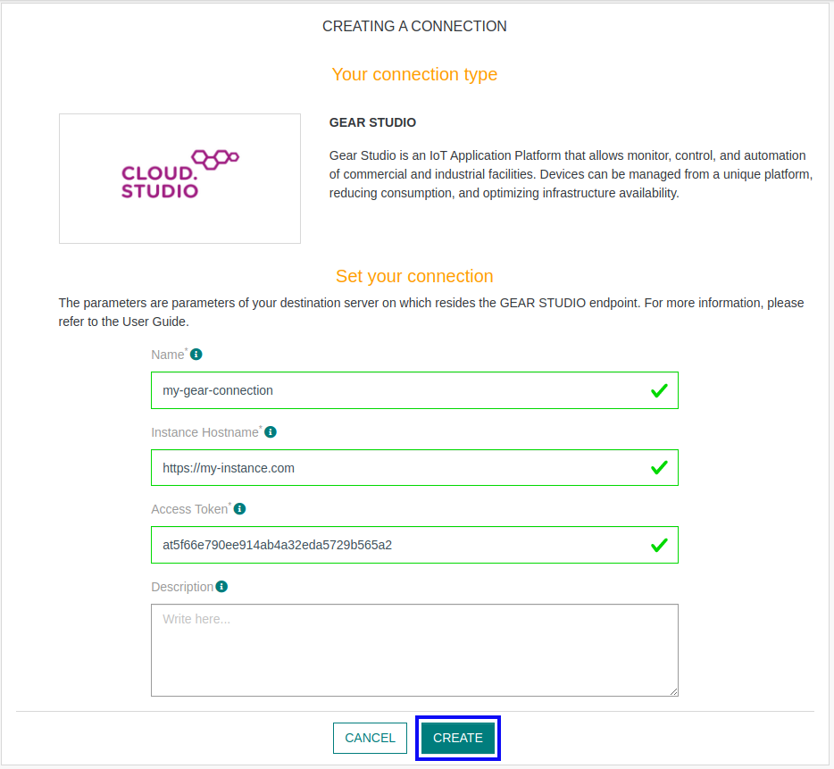
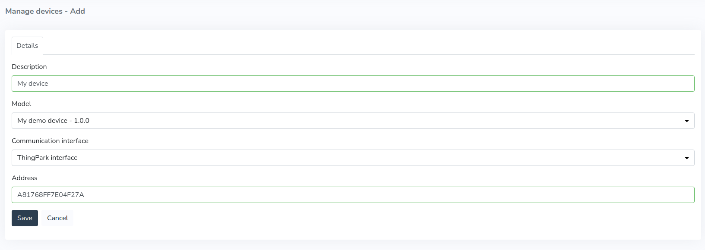
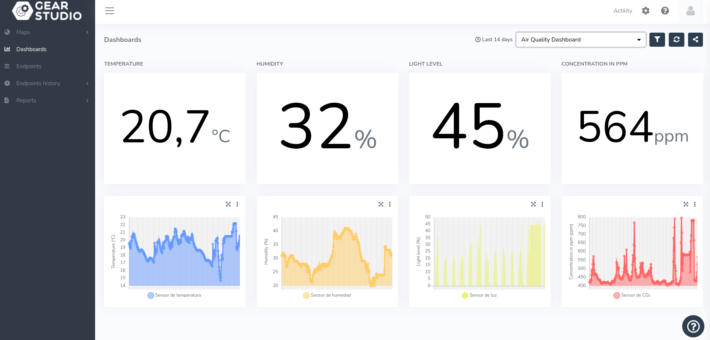

# CREATING A GEAR STUDIO CONNECTION

## Collecting Expected Information

**Parameters required**

| Field | Description |
| ------ | ----------- |
| ```Instance hostname``` | URL used when connecting to Gear Studio instance.|
| ```Access Token``` | Generated in your instance settings.|

### Generate Access Token

**Access Token** is a key that will offer you the possibility to authenticate you.

To get it, you must first go to your instance **settings**.


## Creating a Connection With API

The creation of a connection establishes a unidirectional messaging transport link to the cloud provider.

To do this, you need to use the **Connections** group resource:
*	`POST/connections` to create a new Connection instance
*	`PUT/connections` to update a Connection instance
*	`DELETE/connections` to delete a Connection instance


::: tip Note
We follow the REST-full API pattern, when updating configuration properties for a connection resource. Thus, you must also provide the whole configuration again.
:::

Example for creation of a new connection instance :

```json
POST /connections
{
  "name":"Actility To GearStudio",
  "connectorId":"actility-http-iot",
  "configuration": {
      "instanceHostname":"https://gear.studio.cloud",
      "accessToken":"at5f66e790ee914ab4a32eda5729b565a2"
  },
  "brand":"GEAR_STUDIO"
}
```

The following table lists the properties applicable to a connection instance.

| Field | Description |
| ------ | ----------- |
| ```connectorId``` | Must be set to actility-http-iot for Tago platform. |
| ```configuration/instanceHostname``` | Must be replaced by your Instance hostname, used when you connect to Gear Studio. |
| ```configuration/accessToken``` | Must be replaced by your Access Token created in your instance settings. |
| ```brand``` | Must be set to ```GEAR_STUDIO```. |

::: warning Important note
All properties are not present in this example. You can check the rest of these properties in the [common parameters section](../../Getting_Started/Setting_Up_A_Connection_instance/About_connections.html#common-parameters).
:::

## Creating a Connection With UI

1. Click Connections -> Create -> **ThingPark X IoT Flow**


2. Then, a new page will open. Select the connection type: **Gear Studio**.


3. Fill in the form as in the example below and click on **Create**.


::: tip Note
Parameters marked with * are mandatory.
:::

4. A notification appears on the upper right side of your screen to confirm that the application has been created.

5. After creating the application, you will be redirected to the connection details.

## Gear Studio device configuration

To make your device working in Gear Studio, you have to follow those few steps:

1. Go to your instance settings.

2. Enter in the **Device models**, under **Devices** section. And click the **Add** button.


3. Fill in the form, using your device informations and click the **Save** button.


Your model will now appear in the **Device models** list.


4. Now, edit this device, and go to the **Scripts** section.


* **Configuration** section permits to create device endpoints, like temperature, humidity or whatever you need.

* **Payload parser** section permits to parse uplinks TPX will send.

Here is an example for both script, for a device collecting **Temperature**, **Humidity**, **Light intensity**, and **Motion**.

```javascript
Configuration script


function getConfiguration(config)
{
	 config.addressLabel = {en: "DevEUI", es: "DevEUI"};
}

function getEndpoints(deviceAddress, endpoints)
{
  endpoints.addEndpoint("1", "Temperature sensor", endpointType.temperatureSensor);
  endpoints.addEndpoint("2", "Humidity sensor", endpointType.humiditySensor);
  endpoints.addEndpoint("3", "Light sensor", endpointType.lightSensor);
  endpoints.addEndpoint("4", "Motion sensor", endpointType.iasSensor,iasEndpointSubType.motionSensor);
}

function validateDeviceAddress(address, result)
{
  if (address.length != 16) {
    result.ok = false;
    result.errorMessage = {
      en: "The address must be 16 characters long.",
      es: "La dirección debe tener exactamente 16 caracteres."
    };
  }
}

function updateDeviceUIRules(device, rules)
{
  rules.canCreateEndpoints = false;
}

function updateEndpointUIRules(endpoint, rules)
{
  rules.canDelete = false;
  rules.canEditSubtype = false;
}
```

```javascript
Payload parser script

function parseUplink(device, payload)
{
    var data = payload.asParsedObject();
    var temperature = data.temperature;
    var humidity = data.humidity;
    var light = data.light;
    var motion = data.motion;

    //update temperature
    var e = device.endpoints.byType(endpointType.temperatureSensor);
    if (e != null)
        e.updateTemperatureSensorStatus(temperature);
    //update humidity
    e = device.endpoints.byType(endpointType.humiditySensor);
    if (e != null)
        e.updateHumiditySensorStatus(humidity);
    //update light
    e = device.endpoints.byType(endpointType.lightSensor);
    if (e != null)
        e.updateLightSensorStatus(light);
    //update motion
    e = device.endpoints.byType(endpointType.iasSensor);
    if (e != null)
        e.updateIASSensorStatus(motion);
}
```
5. After setting up those two scripts, you can click on the **Save** button to register those settings. You can now create your first device from this model.

## Limitations

Limitations depends on Account Plan you own.

## Displaying information to know if it worked

1.	Connect to your **Gear Studio** instance, and naviguate to settings.

2.	Go to **Devices** section and click the **Add** button to create a new **Device**.


3.  Fill the form using the device model created before, the Address field correspond to your **Device EUI** (find it on ThingPark device list)



4. Using dashboards(it's not automatically created, you must do it by your own), you'll be able to see if you're receiving uplinks from your device created.



## Troubleshooting

As for now, there are no detected bugs.

* Cloud studio Wiki: <https://wiki.cloud.studio/>