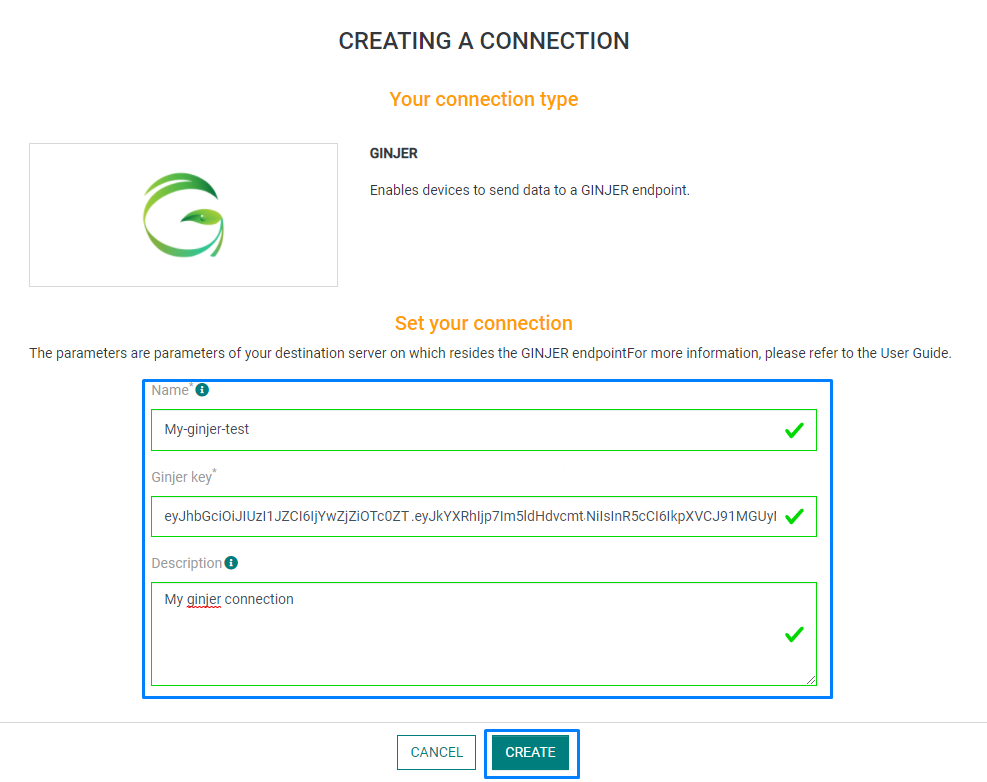
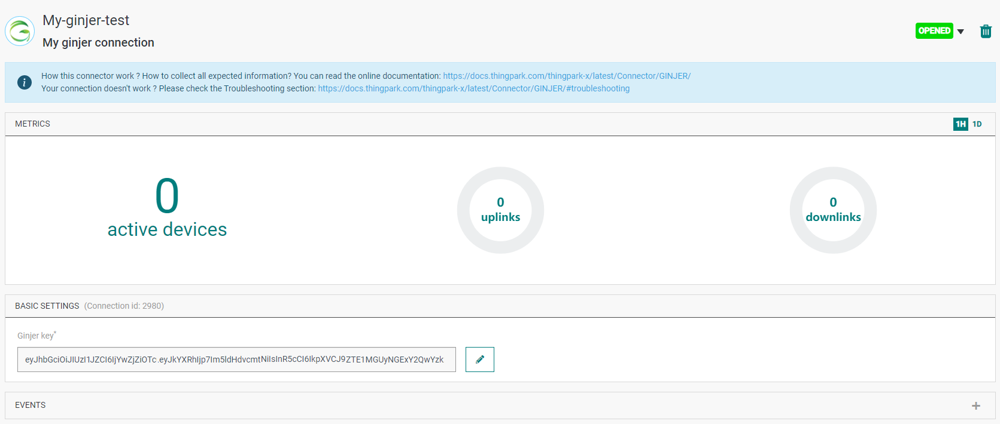
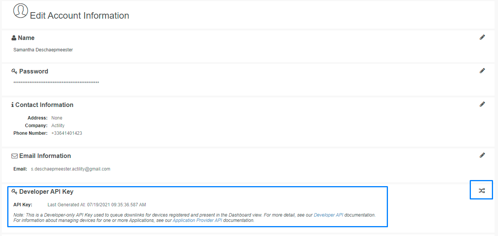

# CREATING A GINJER CONNECTION

## Collecting Expected Information

**Parameters required**

| Field | Description |
| ------ | ----------- |
| ```Application Name``` | Name of the application that you want to register (Editable). |
| ```Ginjer Key``` | The key generated in the network configuration used in your Ginjer account (Editable). |

### Ginjer key

The Ginjer Key is the **API key** generated with your [Ginjer account](https://www.ginjer.io/).
Follow these steps to generate a new GINJER KEY in GINJER:

1. Go to the **Setup** and **Network** sections. Click on your Network's **Configure** button.


2. Click on **Generate a new API Key**.


## Creating a Connection With API

The creation of a connection establishes a unidirectional messaging transport link to the cloud provider.

To do this, you need to use the **Connections** group resource:
*	`POST/connections` to create a new Connection instance
*	`PUT/connections` to update a Connection instance
*	`DELETE/connections` to delete a Connection instance


::: tip Note
We follow the REST-full API pattern, when updating configuration properties for a connection resource. Thus, you must also provide the whole configuration again.
:::

Example for creation of a new connection instance :

```json
POST /connections
{
  "name":"Actility To Ginjer",
  "connectorId":"actility-http-iot",
  "configuration": {
      "description":null,
      "destinationURL":"https://prodapi.ginjer.io/notify",
      "headers":{
        "Authorization":"eyJhbGciOiJIUzI1NiIsInR5cCI6IkpXVCJ9...zoNJI8vty6C-tHJYJlOJSOJsrLuh3ig-M"
    }
  }, 
  "brand":"GINJER",
  "upOperations":[
    {
      "id":"MESSAGE_FLATTENER","type":"callProcessor"
    }
  ]
}
```

The following table lists the properties applicable to a connection instance.

| Field | Description |
| ------ | ----------- |
| ```connectorId``` | Must be set to actility-http-iot for GINJER platform. |
| ```configuration/description``` | Description of the application. |
| ```configuration/destinationURL``` | Must be set to **https://prodapi.ginjer.io/notify**. |
| ```configuration/headers``` | Set of key-values. The only obligatory key is Authorization, which needs your Ginjer key as a value. |
| ```brand``` | Must be set to ```GINJER```. |
| ```upOperations``` | List of operations. The message flattener operation transform the input's body into a single level JSON format. |

::: warning Important note
All properties are not present in this example. You can check the rest of these properties in the [common parameters section](../../Getting_Started/Setting_Up_A_Connection_instance/About_connections.html#common-parameters).
:::

## Creating a Connection With UI

1. Click Applications -> Create -> View More Applications Type.


Then, a new page will open. Select the connection type: **Ginjer**.


2. Fill in the form as in the example below and click on **Create**.



::: tip Note
Parameters marked with * are mandatory.
:::

* A notification appears on the upper right side of your screen to confirm that the application has been created.


4. After creating the application, you will be redirected to the application details.



**Changing the Settings after Creation**

You can change the settings parameters such as the application name or the Ginjer key.

To do this, proceed as follows:

1. Select the GINJER application for which you want to change one or several parameters.

2. In the application information dashboard, click on the **Edit** button corresponding to the parameter you want to change.


3. Enter the new value and click on the **Confirm** icon.

* The Confirmation window displays,


A notification will inform you that the parameter is updated.


## Limitations

There are currently no known limitations to the GINJER connector.

## Displaying information to know if it worked

1.	Connect to your [GINJER account](https://www.ginjer.io/).

2.	Go to the **Projects** section and select your project.


3. Go to the **Devices** section and click on a device you want to monitor.


* You can now see the upcoming messages.


## Troubleshooting

### Consecutive Errors

* Notification Targets that produce 10 consecutive errors when forwarding data will be disabled by the network server. 
This is to prevent excessive load on the target and on the network server. 
  
* A short outage in network connectivity should not trigger the 10 consecutive error limit on most devices. 
However, if your device has a very short transmit interval, it may be possible to reach the 10 consecutive error limit in a very short period of time. 

    If your Notification Target is disabled by the network server, review the Last Error message field in the device details. This error message will help you understand why the notifications are failing. 

    If you believe the errors were caused by an interruption in service that has now been corrected, you can re-enable the Notification Target to restore message forwarding. 

    If the error condition persists, the Notification Target will again be disabled when the error limit is reached.

### Authentication error
Be sure that your device is registered on the Ginjer platform.

## Notes on GINJER configuration

::: warning Important note
This section is entirely for an information purpose. 
If you have trouble configuring your GINJER or SenRa account, please refer to the [Ginjer documentation](https://docs.ginjer.io/) or the [SenRa documentation](https://docs.senraco.io/docs/).
:::

### Create your SenRa account

In order to get some attributes needed in Ginjer, you need to have a [SenRa account](https://portal.senraco.io)
Follow these steps in order to configure your account.

1. Click on your profile and click on **Edit account Info**.


2. Click on the button next to the Developer API Key section to generate a new API key. Write down the key somewhere.



Go to the dashboard, and click on the **Add** button. Select **Add device**.


Fill the form like the example below and click on **Register New Device**.


### Create your Ginjer account

Before creating a connection, you need to [create your GINGER account](https://www.ginjer.io/home/signUp).

1. Create a project and add a new cluster.

2. Configure the network. Go to the Setup/Network section. Click on the network you want to configure. You can also create a new one.


3. Click on **Generate Ginjer key**. Fill the rest of the form. In the **Network Key** field, paste the API Key previously created with your SenRa account.


4. Add devices to the cluster. You will need to provide the following informations:

| Attribute | Description |
| --------- | ----------- |
| **Cluster** | Select the cluster associated to your project. |
| **Name** | Name of the device. |
| **DevEUI** | Unique ID of your device. |
| **Description** | Description of your device. |
| **Network** | Network associated to your device. |
| **Network Key*** | Key that gives access to your network. See below to know how to retrieve it. |
| **Latitude** | Latitude of the device. |
| **Longitude** | Longitude of the device. |

* The Network Key is the **API Key** generated with your SenRa account.


