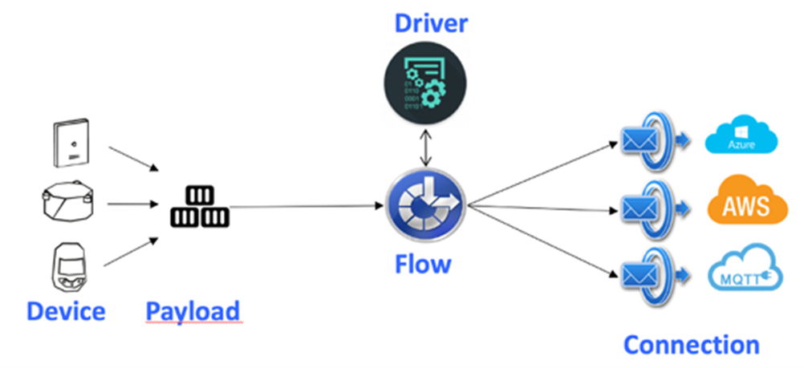

# Key Concepts

Moving your devices’ data using IoT Flow requires two pieces of information that are ***the data source and its destination***. 
In TPX IoT ***Flow***, this information is encapsulated into a Flow object. 
The Flow object allows you to define simple rules in order to route the data from a set of devices to another set of destinations. 
On the source side, a Flow is attached to your devices using ***Keys***(Dev_EUI) or ***Tags***. 
On the destination side, a Flow send the data into a ***Connection***. A Connection uses a ***Connector*** to communication with an external service like a cloud provider.

## Connectors

TP X IoT Flow ***connectors*** are profile that will determine the communication parameters toward the IoT Cloud platform.
Amongst the available connectors currently available you will find generic connectors such as MQTT or HTTP,
as well as application specific connectors like AWS IoT Core or Azure IoT Hub.

## Connection

A ***connection*** is a specific instance of a ***Connector*** for which you define specific parameters to establish a communication 
stream with the selected IoT cloud platform.

## IoT Flow

An  ***IoT Flow*** is the object that will create an association between a sensor and an IoT cloud platform.
This association is done by matching sensors traffic to a specific ***Connection*** using ***tags*** available as metadata in uplink/downlink messages.

